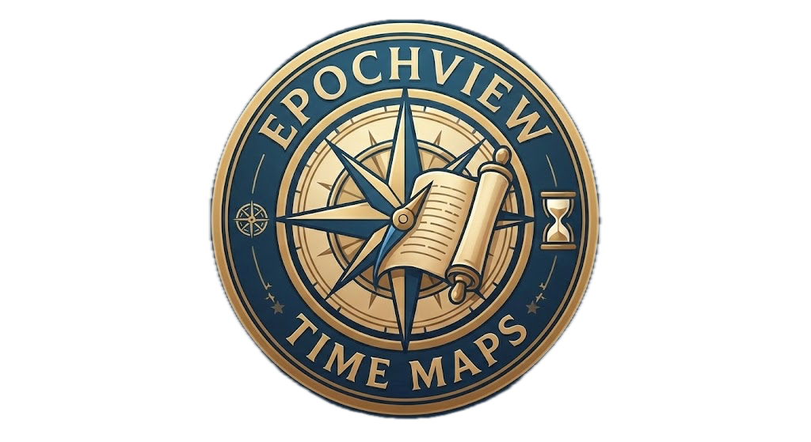
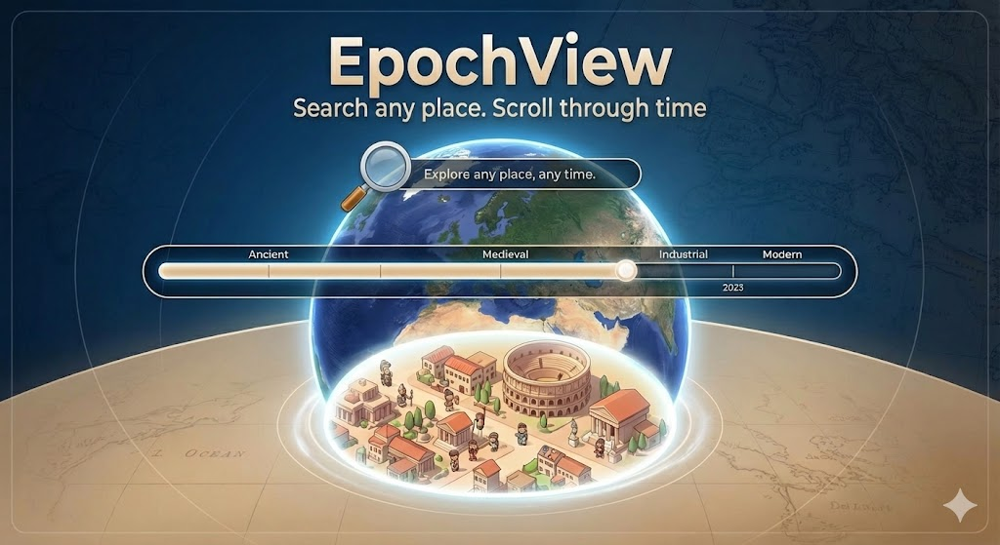
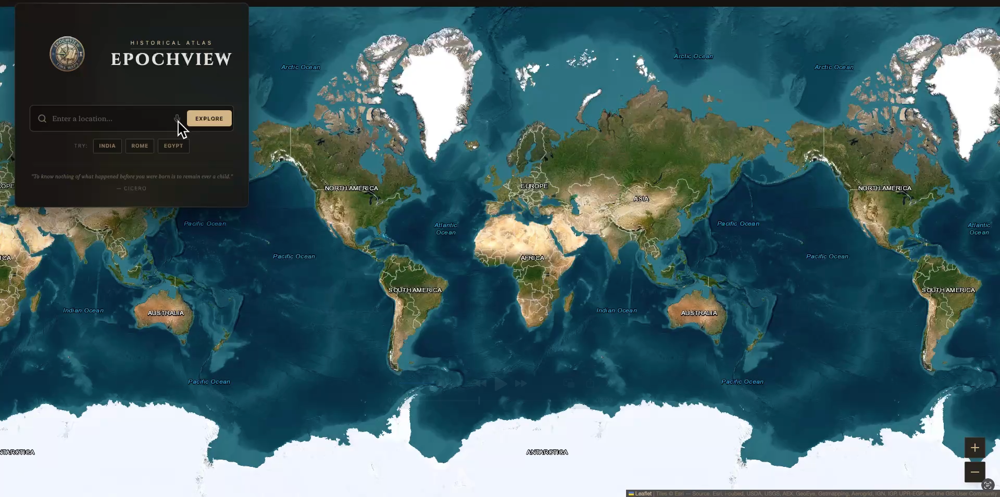
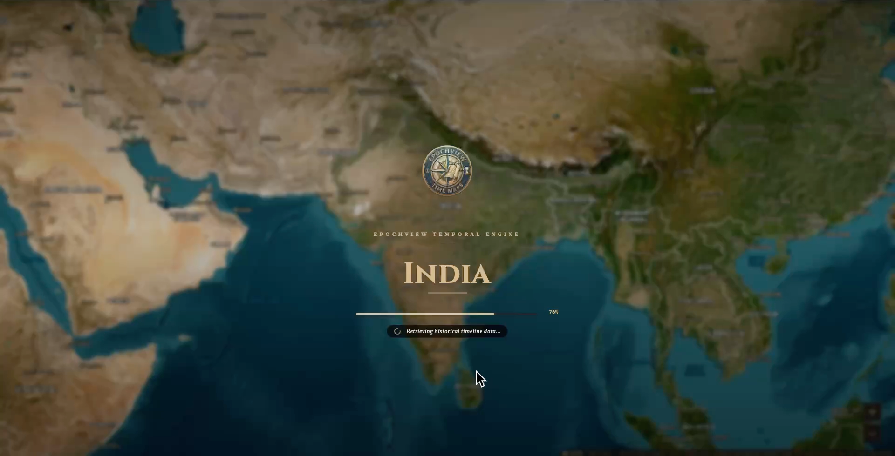
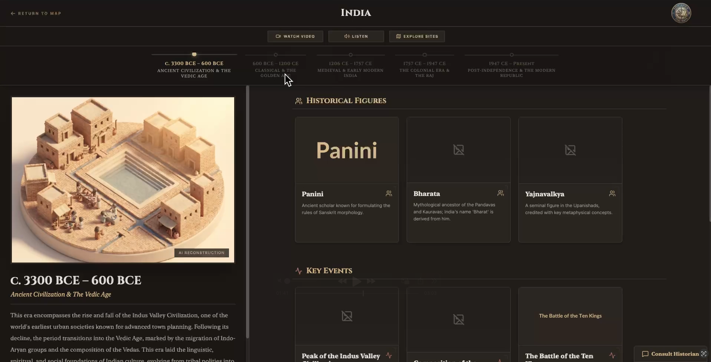
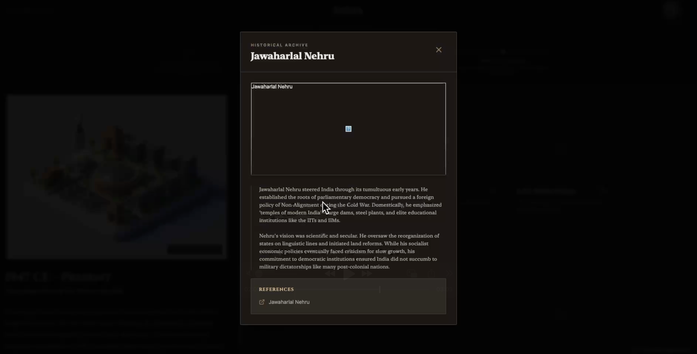
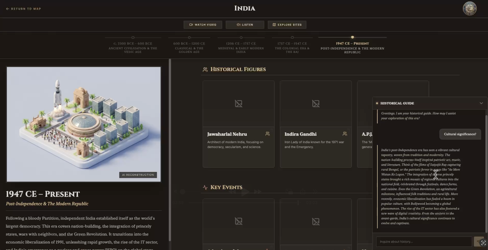

# EpochView

## Demo

EpochView is an interactive web application that transforms static map coordinates into dynamic, immersive historical narratives. It acts as a Time Machine for Places, allowing users to visualize how any location on Earth has evolved over thousands of years, replacing fragmented textbooks with a holistic digital experience.

## How we built it

**Vibe-coded in [Google AI Studio](https://aistudio.google.com/apps)**

**Logo and Cover picture are geenrated using [Nano Banana Pro](https://gemini.google.com/app)**

- **Core Intelligence:** We use Gemini 3 Pro Deep Research to aggregate scattered historical data and segment it into distinct, digestible eras.
- **Multimodal Immersion:** Nano Banana Pro generates 3D isometric views, Veo 3 creates cinematic documentaries, and an integrated Audio Guide powered by Gemini 2.5 Flash TTS provides a narrated tour of each era.
- **Interactive Chat:** A custom Gemini 3 Pro powered chatbot acts as a "local guide" for each era, answering specific questions about the culture, politics, and daily life of the displayed time period.
- **Integration:** These models are anchored by the Google Maps Platform, allowing users to explore existing landmarks alongside their ancient counterparts.

## Why it matters?
History is often abstract and hard to visualize. Knowing history helps to build a better future. EpochView bridges the gap between the past and the physical world. It empowers students with immersive learning, aids researchers by consolidating deep history, and enriches travel by revealing the invisible layers of civilizations. We make history visible, audible, and conversational.

## Run Locally

**Prerequisites:**  Node.js

**Steps:**
1. Install dependencies:
   `npm install`
2. Set the `GEMINI_API_KEY` in [.env.local](.env.local) to your Gemini API key
3. Run the app:
   `npm run dev`

---

## 📸 Snapshots

### Cover

### Homepage
*The main landing page where users can search for any location to explore its history*

### Loading Experience
*Immersive loading screen while EpochView researches and generates historical content*

### Historical Timeline
*Explore different eras and time periods of a location's rich history*

### Content View
*Detailed historical content with AI-generated 3D isometric views and narratives*

### Interactive Chat
*AI-powered local guide chatbot that answers questions about each historical era*

---

## 📄 License

This project is licensed under the MIT License - see the [LICENSE](LICENSE) file for details.